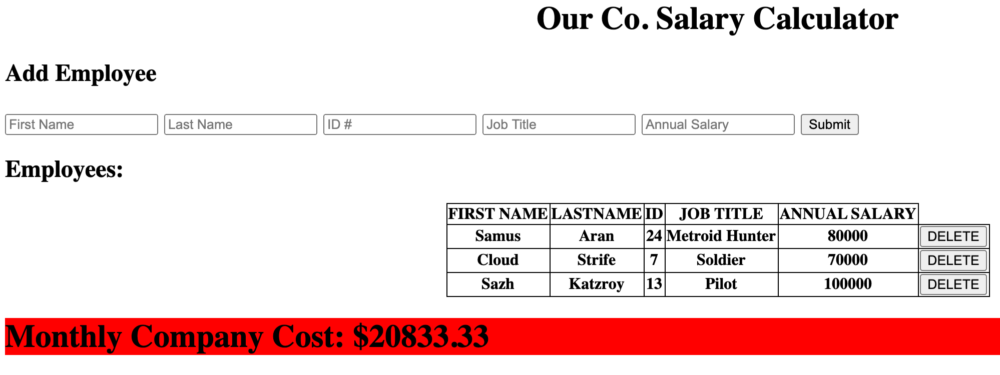

# jQuery Salary Calculator

## Description

_Duration: 10 hrs_

This application allows you to ostensibly add employees to Our Co. and see the reflected cost to Our Co. 

## Installation

1.Fork the public repository, https://github.com/JoelleKado/jquery-salary-calculator.
2. Clone the forked rep to your local machine.
3. Open `/index.html` in your web browser.

## Usage
To view the current financial status of our Company, pending induction of a new employee:

1. Open Our Co. Salary Calculator in your web browser.
2. Input employee information into the input fields on the New Employee Form.
3. Once all fields are filled, click the Submit Button, and a snapshot of Our Co.'s roster, along with Our Co.'s salary obligations will be showcased on your screen. *A red banner indicates an instance where Our Co. cannot afford the employee roster.
4. To remove an employee from the showcase, click the the DELETE button to the right of the employee record.

## Future Development
* Graphics

## Acknowledgement
Thanks to [Prime Digital Academy](www.primeacademy.io) who equipped and helped me to make this application a reality. (Thank you: https://github.com/zuberabdikadir, https://github.com/sdeda1us, https://github.com/jordanNewberry21); for being a great Pod!

## Support
If you have need help, have suggestions, or experience issues; please, email me at [jkado@my.hpu.edu](www.google.com)
